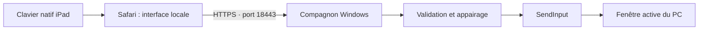

# Architecture

Le serveur Python utilise ThreadingHTTPServer enveloppé dans TLS. Les fichiers web intégrés sont servis par le même serveur. La fenêtre Tkinter et l’icône pystray vivent dans la session Windows ; masquer la fenêtre ne coupe pas le serveur. Les événements de l’icône sont transmis à Tk par une file traitée sur son thread principal.

## Routes

| Route | Rôle |
|---|---|
| GET / et ressources explicites | Interface locale et JavaScript/CSS |
| POST /pair | Échange du code contre un cookie d’accès |
| POST /command | Validation puis exécution d’une commande autorisée |

Les requêtes du client transmettent Origin et X-Keyboard ; le cookie est HttpOnly. Les commandes comprennent status, direct, text, key, app et media. Il n’existe pas de commande shell arbitraire. Les identifiants d’application et les touches sont validés par des listes explicites.

## Saisie directe

Le client transmet un identifiant de zone, l’ancienne base et le nouveau texte. Le serveur applique le changement de fin de texte sous contrôle de cible et d’activité physique. Un changement de cible ou une suppression ambiguë interrompt le suivi. Le client ne rejoue pas automatiquement une frappe au résultat incertain. Le client web utilise auto=true : lors d’un changement de cible, seul un nouveau suffixe est envoyé ; une correction ancienne est ignorée. La zone suivante repart de zéro automatiquement. Le protocole strict des anciens clients reste disponible.

## Données persistantes

ASSET_ROOT désigne les ressources embarquées. ROOT désigne le dossier du script, ou le dossier de l’exécutable pour une compilation PyInstaller. private/ est donc conservé près de l’application, en dehors du dossier temporaire d’extraction du binaire.

L’application native iOS expérimentale réutilise le protocole mais n’est pas incluse dans l’exécutable Windows et n’a pas été compilée dans cette publication.
