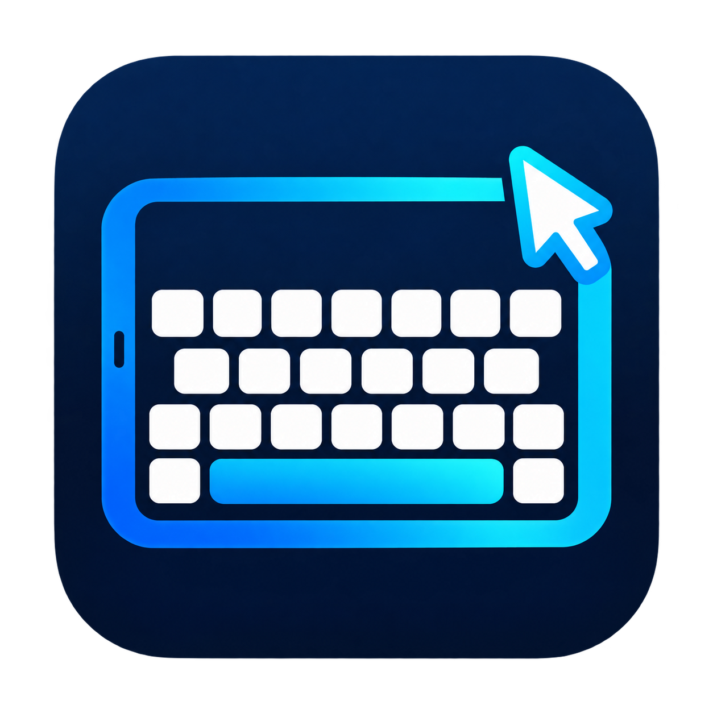

# Clavier iPad pour Windows

**Écris sur ton PC avec le vrai clavier de ton iPad, ses suggestions et ses corrections.**

Le compagnon Windows reçoit les commandes sur le réseau local. L’iPad utilise Safari : aucune application App Store n’est nécessaire pour cette version. De gros boutons donnent accès aux touches PC, raccourcis, chiffres et commandes multimédia.

**Version 1.2.1 — première publication, encore en développement.** Windows 10/11 x64 ; interface en français. macOS n’est pas pris en charge. Les sources natives iOS sont [expérimentales](ios/README.md), sans IPA compilé.

## Télécharger

➡ **[Télécharger le Setup Windows](https://github.com/myjerec/clavier-ipad-windows/releases/latest/download/Clavier-iPad-Setup.exe)**

- [Version portable complète (ZIP)](https://github.com/myjerec/clavier-ipad-windows/releases/latest/download/Clavier-iPad-Portable.zip) : extraire le dossier puis lancer `Clavier-iPad.exe`.
- Le `.exe` est fourni avec son dossier `_internal` dans le ZIP : garde les deux ensemble. Le Setup installe tout automatiquement, sans Python à installer.
- [Toutes les versions et sommes SHA-256](https://github.com/myjerec/clavier-ipad-windows/releases).

Le Setup installe l’application pour ton compte Windows, propose un raccourci sur le Bureau et ajoute une entrée de désinstallation. Les binaires ne sont pas signés avec un certificat d’éditeur commercial.

## Première connexion

1. Installe et lance le compagnon sur le PC. Mets l’iPad et le PC sur le même réseau local (le PC peut être en Ethernet).
2. Configure la confiance du certificat local sur l’iPad : la première connexion HTTPS nécessite cette étape. [Guide pas à pas](LIRE-MOI.md#certificat-local--première-utilisation).
3. Clique sur **Connecter mon iPad avec un QR code**, scanne avec Appareil photo et ouvre le lien dans Safari. Tu peux aussi recopier l’adresse affichée.
4. Saisis les huit chiffres du code d’appairage affiché sur le PC. L’iPad sera mémorisé.
5. Clique dans le document à remplir sur le PC, puis touche **Clavier iPad** dans Safari et écris.

Le QR code ouvre l’adresse : il n’installe pas le certificat et ne contourne pas l’appairage. Utilise toujours l’adresse affichée par ton propre compagnon.

## Fonctions

| Fonction | Ce qu’elle permet |
|---|---|
| Clavier Apple | Saisie directe, suggestions et corrections fournies par iPadOS |
| Touches PC | Ctrl, Alt, Maj, Windows, AltGr, Tab, Échap, Entrée, Retour arrière, Suppr |
| Navigation | Flèches, Début/Fin, Page précédente/suivante, F1–F12 |
| Raccourcis | Copier, coller, annuler, changer de fenêtre, navigateur, enregistrer, imprimer… |
| Presse-papiers | Texte iPad ↔ PC, avec accès explicite et zone de secours |
| Pavé numérique | Chiffres, séparateurs et opérations, sans dépendre de Verr. Num |
| Applications | Navigateur, Bloc-notes, Explorateur, Calculatrice, Paint, Discord si installé |
| Son et musique | Volume, muet, lecture/pause et changement de piste |
| Mes boutons | Phrases favorites et raccourcis personnalisés stockés sur cet iPad |
| Compagnon Windows | Thème sombre, gros boutons, QR code, copie d’adresse, pause et nouvel appairage |
| Arrière-plan | Masquage près de l’horloge ; double-clic sur l’icône pour réafficher |

## Connexion et confidentialité

La communication clavier reste sur le réseau local en HTTPS. Le serveur écoute uniquement sur l’adresse choisie, port TCP **18443**. Il n’ouvre pas de port sur ton routeur. N’ajoute aucune redirection vers Internet.

L’appairage est conservé entre deux lancements ; le PC sauvegarde l’empreinte du jeton, et Safari conserve un cookie sécurisé. **Nouvel appairage** révoque l’accès précédent. La connexion exige un PC allumé, le compagnon actif (même masqué) et un réseau disponible. Une mise en veille peut interrompre la session.

Les clés, certificats et données d’appairage sont générés sur chaque PC dans `private/` et ne sont pas présents dans ce dépôt ni dans les téléchargements. Voir [SECURITY.md](SECURITY.md).

## À savoir avant de l’utiliser

- Les frappes vont dans **la fenêtre active du PC**. La saisie reprend automatiquement après un changement de fenêtre ou de curseur. Une correction portant sur l’ancienne zone est ignorée.
- **Ctrl+Alt+Suppr**, l’écran verrouillé, les demandes UAC et les fenêtres exécutées en administrateur ne sont pas pris en charge.
- Certaines corrections impliquant emoji, caractères combinés ou retours à la ligne sont arrêtées pour éviter un effacement ambigu. Voir le guide.
- Les tests automatisés et les essais Windows ne remplacent pas des essais sur tous les modèles d’iPad et toutes les applications. [État des validations](VALIDATION.md).

## Documentation

- [Installation, utilisation et dépannage](LIRE-MOI.md)
- [Compiler le .exe et le Setup, lancer les tests](DEVELOPPEMENT.md)
- [Architecture et protocole](ARCHITECTURE.md)
- [Sécurité et données locales](SECURITY.md)
- [Historique de la version](CHANGELOG.md)
- [Sources iOS non compilées](ios/README.md)

## Licence et crédits

Projet de **[myjerec](https://github.com/myjerec)**, publié sous [licence MIT](LICENSE). Tu peux utiliser, modifier et redistribuer le code en conservant la notice de licence et le crédit. Les bibliothèques tierces conservent [leurs propres licences](THIRD_PARTY_NOTICES.md).
